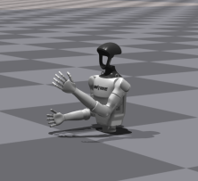

# 🤖 Unitree G1 Inverse Kinematics Demo  
*Basic hand movement implementation using inverse kinematics for Unitree G1 humanoid robot*

[](https://github.com/yediong/IK-humanoid)

---

## 📌 Overview  
Implementation of **inverse kinematics (IK)** based hand movement control for Unitree G1 humanoid robot, built upon the official [Unitree RL example framework](https://github.com/unitreerobotics/unitree_rl_gym).

<div align="center">
  
</div>

---

## ⚙️ Features
- Basic IK implementation using damped least squares method
- 3D position control for left hand movement
- Joint angle control through action setting
- Integration with IsaacGym simulation platform

---

## 🛠️ Prerequisites
### System Requirements
| Component      | Recommended Configuration |
|----------------|--------------------------|
| OS             | Ubuntu 20.04 LTS         |
| ROS            | Noetic                   |
| Python         | 3.8                      |
| PyTorch        | 1.10.0+cu113             |

### Dependencies
1. [IsaacGym Preview 4](https://developer.nvidia.com/isaac-gym)
2. [rsl_rl v1.0.2](https://github.com/leggedrobotics/rsl_rl)

Place both dependencies in the same project directory as this repository.

---

## 📦 Installation
### 1. Create Virtual Environment
```bash
conda create -n rl-g1 python=3.8
conda activate rl-g1
```

### 2. Install PyTorch
```bash
pip3 install torch==1.10.0+cu113 \
    torchvision==0.11.1+cu113 \
    torchaudio==0.10.0+cu113 \
    -f https://download.pytorch.org/whl/cu113/torch_stable.html
```

### 3. Install Dependencies
```bash
# Install IsaacGym (from extracted python directory)
pip install -e isaacgym/python

# Install rsl_rl
git clone https://github.com/leggedrobotics/rsl_rl
cd rsl_rl
git checkout v1.0.2
pip install -e .
```

---

## 🚀 Quick Start
### 1. Clone Repository
```bash
git clone https://github.com/yediong/IK-humanoid.git
```

### 2. Configure Paths
Update the path in these files to match your system:
- `legged_gym/scripts/play_g1_handmove.py`
- `legged_gym/scripts/play_g1_ik.py`

### 3. Run Demos
```bash
conda activate rl-g1
cd legged_gym/scripts

# Angle control demo
python play_g1_handmove.py

# IK position control demo
python play_g1_ik.py
```

---

## 🧪 Usage
Modify parameters directly in Python files to adjust:
- Target positions (x, y, z)
- Joint angles
- Movement speed
- Damping coefficients

---

## 📚 Documentation
For detailed control routines and API references:
- [Official RL Control Guide](https://support.unitree.com/home/zh/G1_developer/rl_control_routine)
- [Unitree RL Gym Framework](https://github.com/unitreerobotics/unitree_rl_gym)

---

## 📝 Notes
This project provides a foundational implementation for beginners to:
- Understand IK application in humanoid robotics
- Explore IsaacGym simulation environment
- Implement basic movement patterns

Further optimization and advanced control strategies are required for production-level applications. Feel free to open issues for questions or suggestions.

---

*Created with ❤️ by [yediong](https://github.com/yediong)*
